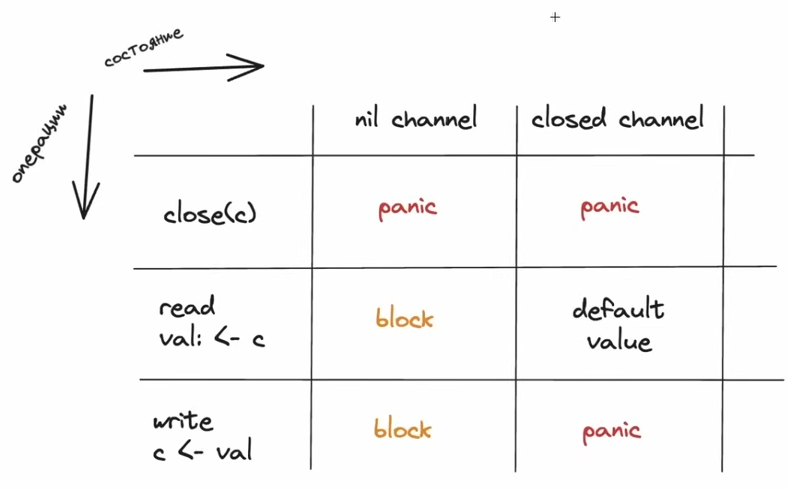
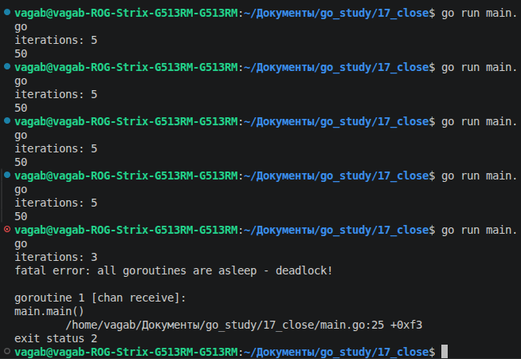

**Главная страница:** [[Ссылки на темы]]

Аксиома в своем определении это положение, принимаемое без доказательств
Тоесть,доказания того, как работают те или принципы каналов не будет))))
 И не потому что мне в падлу это записывать,а потому что разрабы го не потрудились это все объяснить, остается смириться

## Аксиомы каналов



Тут у нас столбцы и строки
Два столбца:
1) nil channel
2) closed channel

Три строки:
1) close(c)
2) read val:= <-c
3) write c<-val

Что они означают?
Закрытый канал, это канал который закрыт(ну понятно):
```go
package main

func main() {
	ch := make(chan int)
	close(ch) // вот закрытие канала, значит ch закрытый канал
}
```

А nil канал,это канал объявленный таким способом:
```go
var ch chan int
``` 
То есть, есть переменная типа chan int, но не создаем канал через make(); каналы и мапы мы обязаны создавать через make(), но если мы этого не сделали(в случае каналов), то будет nil канал

Теперь будем разбираться со столбцами, начнем с закрытых каналов
```go
package main

func main() {
	// создаем новый открытый канал
	ch := make(chan int)
	// закрываем канал
	close(ch) // код после этого будет работать с закрытым каналом
	//..
}
```

 При операции close(с) и состоянии closed channel мы получим panic, это значит,что при закрытии закрытого канала выскочит panic:
 ```go
	close(ch)
	close(ch)// повторное закрытие 

 ```

Вывод в консоли:

 ```bash
 panic: close of closed channel

goroutine 1 [running]:
main.main()
        /home/vagab/Документы/go_study/17_close/main.go:9 +0x30
exit status 2
 ```

 При операции read val:<- и состоянии closed channel мы получим default value, это значит,что при чтении закрытого канала выскочит значение по умолчанию:
 ```go
close(ch)
v := <-ch // так как канал работает с int значениям, то запишется 0
fmt.Println(v) // выведет 0
 ```

То есть, если канал закрыт, то мы все равно можем из него читать, причем не один раз, а сколько угодно 
Если мы читаем из канала и получаем значение по умолчанию, то мы можем также узнать,является ли полученное значение значением по умолчанию или нет,это можно сделать через переменную ok, если ok = true, то получено настоящее значение в канал где-то из другой горутины, если false, значит полученное значение не было каком-то значением из горутины, значит это значение по-умолчанию
```go
close(ch)
v1, ok1 := <-ch
v2, ok2 := <-ch
v3, ok3 := <-ch
fmt.Println("v:", v1, v2, v3) // выведет 0 0 0
fmt.Println("ok:", ok1, ok2, ok3) // выведет false false false
```
То есть все 3 значения были значениями по-умолчанию

Получается,что из закрытого канала можно читать,но получать мы оттуда будем значение по-умолчанию

При операции write c<- val и состоянии closed channel мы получим panic, это значит,что при записи в закрытый канал выскочит паника:
```go
// закрываем канал
close(ch)
// запись значения в закрытый канал
ch <- 10
```

А вот и вывод:
```bash
panic: send on closed channel

goroutine 1 [running]:
main.main()
        /home/vagab/Документы/go_study/17_close/main.go:11 +0x37
```

В итоге мы пока узнали: 
1) Закрывать канал можно только 1 раз
2) При чтении закрытого канала оттуда возвращается значение по-умолчанию, опционально можно узнать является ли значение из канала значением по-умолчанию(через ok), если да,то канал закрыт
3) Записывать в закрытый канал нельзя

И тут возникает вопрос, а зачем вообще закрывать канал, если у нас одни паники и значение по-умолчанию выскакивает, ведь канал нужен чтобы туда записывать и читать,зачем его закрывать?

В качестве примера приведем тех же шахтеров, вот у нас тот же прораб(main горутина), шахтер(горутина) и пункт сдачи(канал):
```go
package main

import "fmt"

func main() {
	transferPoint := make(chan int)
	// miner
	go func() {
		transferPoint <- 10
	}()
	coal := <-transferPoint
	fmt.Println(coal) 
}
```

 И этот код у нас отработает как надо, выведется 10 
 
А теперь представим,что наш шахтер заранее не будет знать сколько угля находится в этой шахте, для имитации рандомности сделаем так:
```go
iterations := 3 + rand.Intn(4) // с 3 до 6
```

Мы тут задали диапозон значений от 3 до 6, ведь вспомним что делает rand.Intn(), она генерирует значение от 0  до n-1, где n - аргумент функции rand.Intn(), и получается что у iterations будет значение 3+0 или 3+1 или 3+2 или 3+3
Теперь сделаем цикл, по которому шахтер будет закидывать в шахту по 10 угля iterations раз
```go
for i := 1; i <= iterations; i++ {
	transferPoint <- 10
	time.Sleep(300 * time.Millisecond) // имитация копания
}
```

И проблема кроется в том,что прораб не знает сколько раз надо сходить к пункту выдачи
``` bash
iterations: 6
10
```

Итераций было 6, тоесть туда надо было пойти 6 раз, но мы пошли только 1 и по итогу 50 угля потерялось
В теории можно просто поставить несколько чтений из канала,чтобы не потерять ничего, но опять же проблема в том,что неизвестно количество итераций и если сделать допустим так(поставить условно 5 операций чтения):
```go
coal := <-transferPoint
coal += <-transferPoint
coal += <-transferPoint
coal += <-transferPoint
coal += <-transferPoint
```
но если выскочит итераций 3,то будет дедлок:
```bash
iterations: 3
fatal error: all goroutines are asleep - deadlock!

goroutine 1 [chan receive]:
main.main()
        /home/vagab/Документы/go_study/17_close/main.go:25 +0xf3
exit status 2
```

**Немного отходя от темы:** 
Я буквально раз 7 запустил прогу,чтобы дедлок словить, чтобы было потятнее: из 4 событий(iterations = 3; 4;5;6) благоприятных только 2(5 и 6), остальные к дедлоку ведут, во истину русская рулетка


 У нас получилось так: горутина передала данные каналу 3 раза и завершилась, а канал попытался и 4 раз прочитать, но завис и словил дедлок

Получается,что вот так сидеть угадывать нет никакого смысла 

Можно через бесконечный цикл, чисто инициализировать переменную с общим количеством угля до, а в цикле каждую итерацию создавать переменную,которая читает канал и прибавляется к coal
```go
coal := 0
for {
	v := <-transferPoint
	coal += v
	fmt.Println(coal)
}
```

Но сюрприз, это приведет также к дедлоку:
```bash
iterations: 3
10
20
30
fatal error: all goroutines are asleep - deadlock!

goroutine 1 [chan receive]:
main.main()
        /home/vagab/Документы/go_study/17_close/main.go:24 +0x85
exit status 2
```
Хоть у нас и сохранилось в итоге нужное количество угля, мы все равно пришли к дедлоку
Почему так? А потому что цикл бесконечный, он не знает когда остановиться, поэтому даже после того, как весь уголь собран, горутина все еще пытается читать канал
Как тогда сделать так,что бы не ловить постоянно дедлоки? Вот тут то на помощь приходит close()
Мы со стороны main() горутины не знаем,когда закрывать канал,но знаем когда его закрывать со стороны горутины(когда итерации закончились ), также, с помощью ok мы можем понять, когда закрыт канал(когда вернулось false, тоесть значение по-умолчанию) и выйти из цикла
Учитывая все это дополняем нашу программу:
```go
package main

import (
"fmt"
"math/rand"
"time"
)

func main() {
	transferPoint := make(chan int)
	// miner
	go func() {
		iterations := 3 + rand.Intn(4)
		fmt.Println("iterations:", iterations)
		for i := 1; i <= iterations; i++ {
			transferPoint <- 10
			time.Sleep(300 * time.Millisecond)
		}
		close(transferPoint)
	}()
	
	coal := 0
	for {
		v, ok := <-transferPoint
		if !ok {
			break
		}
		coal += v
		fmt.Println(coal)
	}
}
```

Кстати, можно читать значения из канала более красиво:
```go
for v := range transferPoint {
	coal += v
	fmt.Println(coal)
}
```

Этот цикл как раз завершится,когда канал закроется и не будет смысла проверять через ok
Но если не закрыть канал, то будет дедлок 

Какой итог? Канал надо закрывать как минимум для того,чтобы при условно ошибочной попытке чтения(когда уже нечего читать) не словить дедлок, а как максимум для того,чтобы люди,которые пользуются твоим каналом при своих манипуляциях с кодом не ловили постоянно дедлоки

Если говорить об операциях закрытия канала, чтения из него или записи туда, если у нас nil канал, то при попытке закрытия будет паника:
```go
package main

func main() {
	var ch chan int
	close(ch)
}
```

Вывод:
```go
panic: close of nil channel

goroutine 1 [running]:
main.main()
        /home/vagab/Документы/go_study/17_close/main.go:6 +0x15
exit status 2
vagab@vagab-ROG-
```
 А если записать или прочитать:
 ```go
 package main
 
import "fmt"

func main() {
	var ch chan int
	go func() {
		ch <- 10
	}()
	v := <-ch
	fmt.Println(v)
}
 ```

И в итоге мы ловим дедлок, так как одна горутина заблокировалась навечно чтобы что-то туда записать,а вторая заблочировалась навечно чтобы что-то оттуда прочитать:
```bash
fatal error: all goroutines are asleep - deadlock!

goroutine 1 [chan receive (nil chan)]:
main.main()
        /home/vagab/Документы/go_study/17_close/main.go:12 +0x4a

goroutine 19 [chan send (nil chan)]:
main.main.func1()
        /home/vagab/Документы/go_study/17_close/main.go:9 +0x1e
created by main.main in goroutine 1
        /home/vagab/Документы/go_study/17_close/main.go:8 +0x35
exit status 2
```

Вывод: с nil каналом не надо работать, инициализируйте через make(), вот так:
```go
var ch chan int = make(chan int)
```

