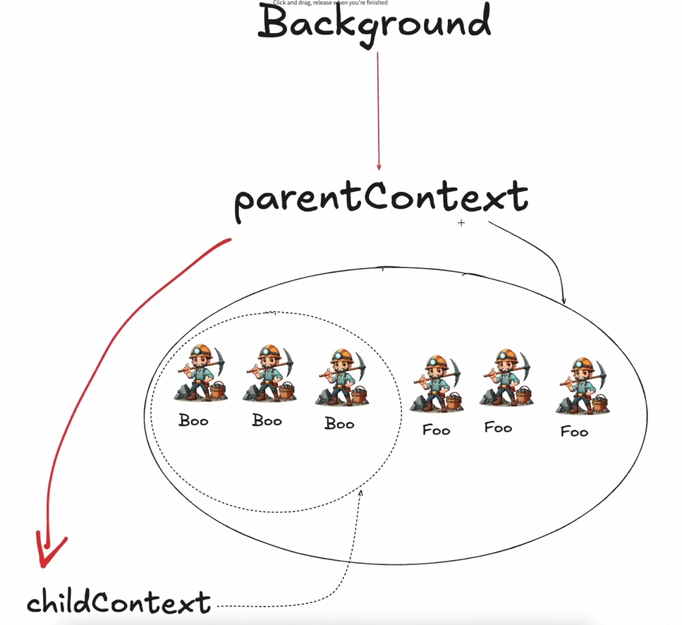
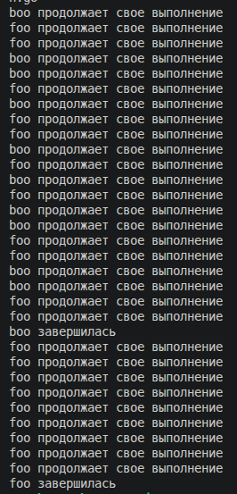
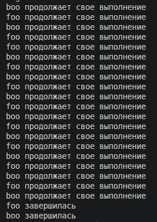

**Главная страница:** [[Ссылки на темы]]

Раньше когда мы запускали горутины, мы ждали,пока закончится их выполнение, но бывают ситуации, когда нам надо завершить часть наших горутин или все горутины по одной команде, эту возможность нам предоставляет контекст 

То есть можно несколько горутин объединить в какой-то контекст(логический набор, множество), ну или другими словами запихнуть несколько горутин в один контекст, и потом с помощью этого контекста мы сможем наши горутины завершить   
Контекст позволяют разделять приложение на логические модули, то есть мжет быть там модуль всего приложения, а может быть модуль для работы с бд , ну например это горутинки функции Boo(), и если в один момент мы захотели остановить горутины связанные с бд (которые в нашем случе горутинки Boo()),  то это можно сделать через контекст
То есть, мы можем контекст отменить и он отменит все завязанные на нем горутинки  
Теперь вернемся к нашей картинке; Самый главный контекст у нас в go это background контекст, так как его нельзя отменить, он есть всегда,  доступен из всех мест приложения и нужен для того,чтобы от него унаследовать другой контекст и на этот контекст записать горутины, короче просто главный контекст от которого наследуются другие контексты, а другие контексты уже можно отменять, тем самым отменяя горутины контекста 
Далее у нас идет parentContext, то есть контекст, на который были записаны горутинки  из картинки(те что в овале беспрерывной линии), от parentContext мы унаследовали childContext и уже там записали горутинки, которые обрабатывают функцию Boo() 

Как будут отменяться горутинки при отмене того или иного контекста? 
Если отменить childContext, то отменятся горутины под ним, а если отменить parentContext, то отменятся горутины,  которые завязаны под него И все дочерние контексты(то есть, отменятся горутины дочернего контекста в том числе)  

## Как это выглядит в коде?

Возьмем также foo()  и boo(), там сделаем бесконечные циклы, которые выводят что-то и засыпают перед следующей итерацией, вызовим их в main() ну и сделаем sleep на 3 секунды,чтобы горутины успели что-то вывести:
```go
package main

import (
	"fmt"
	"time"
)

func foo() {
	for {
		fmt.Println("foo")
		time.Sleep(100 * time.Millisecond)
	}
}

  

func boo() {
	for {
		fmt.Println("boo")
		time.Sleep(100 * time.Millisecond)
	}
}

  

func main() {
	go foo()
	go boo()
	time.Sleep(3 * time.Second)
}
```

И если запустить эту прогу, то все должно работать нормально, просто будут выводы foo и boo подряд
Но можно завершать те или иные горутины до завершения программы, для начала надо объявить контекст:
```go
parentContext, parentCansel := context.WithCancel(context.Background())
```
Что означает эта запись?  Она означает, что мы из контекста background создали родительский контекст(parentContext) с возможностью отмены

Отмена реализуется с помощью функции context.WithCancel(), так как она из передаваемого туда контекста возвращает какой-то  контекст, в нашем случае parentContext, и функцию, которая руками нам позволит отменить возвращаемый контекст, в нашем случае parentCansel )

Теперь создадим дочерний контекст, делается это так:
```go
childContext, childCansel := context.WithCancel(parentContext)
```
То есть, также, как и родительский создаем,только передаем не background, а родительский контекст 

Теперь надо наши горутины завязать на контекст, а то сейчас они у нас ни к чему не привязаны:
```go
func foo(ctx context.Context) {
	for {
		
		select {
		case <-ctx.Done():
			return
		default:
		fmt.Println("foo")
		}
		time.Sleep(100 * time.Millisecond)
	}
}
```
 В функции просто в качестве аргумента прописываем некий ctx с типом context.Context, который кстати является интерфейсом, так как контекст может быть разный(некоторые методы контекста работают с целочисленными значениями, некоторые со строками и тд ) 
Теперь поясню за конструкцию с select{}:  в default у нас будет обрабатываться наш текст, который должен обрабатываться как обычно, если контекст будет отменен,то сработает  `case <-ctx.Done():` ,как оно работает? Внутри контекста у нас по сути есть канал ,и как канал закроется через отмену, у нас и контекст закроется, ну и как известно из прошлой темы, читая из закрытого канала мы получаем значение по-умолчанию; еще раз, как у нас срабатывает функция закрытия контекста, у нас закрывается канал, начинается чтение из канала контекста, от чего кейс срабатывает и мы завершаем контекст. Но если говорить коротко, то стоить просто запомнить,что секция `case <-ctx.Done():` разблокируется если был отменен где-то контекст  
А как отменить то контекст? Тут все проще, достаточно просто вызвать наши функции отмены(они если что выше показаны) 
```go
time.Sleep(1 * time.Second)
childCansel() // отмена дочернего контекста

time.Sleep(1 * time.Second)
parentCansel() // отмена родитеьского контекста 
```

И того у нас получается :
```go
package main

import (
	"context"
	"fmt"
	"time"
)

// родительский контекст
func foo(ctx context.Context) {
	
	for {
		select {
		case <-ctx.Done():
			fmt.Println("foo завершилась")
			return
		default:
			fmt.Println("foo продолжает свое выполнение")
		}
		time.Sleep(100 * time.Millisecond)
	}
}

  

// дочерний контекст
func boo(ctx context.Context) {
	for {
		select {
		case <-ctx.Done():
			fmt.Println("boo завершилась")
			return
		default:
			fmt.Println("boo продолжает свое выполнение")
		}
		time.Sleep(100 * time.Millisecond)
	}
}

  

func main() {
	parentContext, parentCansel := context.WithCancel(context.Background())
	childContext, childCansel := context.WithCancel(parentContext)
	
	go foo(parentContext)
	go boo(childContext)
	
	time.Sleep(1 * time.Second)
	childCansel()
	
	time.Sleep(1 * time.Second)
	parentCansel()
	
	time.Sleep(3 * time.Second)
}
```

Мы создаем 2 контекста,parentContext наследуется от  background, a childContext от parentContext, далее мы запустили 2 горутины, куда передали наши контексты,  после чего мы подождали секунду, завершили childContext через childCansel(), а потом еще через секунду parentContext через 	parentCansel(), это кстати хорошо видно в выводе в консоль


а что если сначала отменить родительский, а потом дочерний?
```go
time.Sleep(1 * time.Second)
parentCansel()

time.Sleep(1 * time.Second)
childCansel()
```
А все просто, у нас сразу обе функции завершатся, не смотря на то,что только в foo() передан parentContext


Почему так ? Мы отменили родительский контекст, у нас отменилась foo(), но за родительским отменился дочерний, от чего отменилась и boo()

Если объявить там по 3 вида каждой функции(3 foo() и 3 boo()), то также сначала они будут обе работать, потом при отмене дочернего контекста все 3 boo() перестанут работать,  будут работать только foo() и со временем все 3 foo() тоже не будут работать

## Зачем оно надо?
В теории наше приложение можно прибить через диспетчер задач, но это быстрое завершение программы, которое жестко прерывает все действующие процессы, которые по-хорошему надо бы завершить до конца, вместо этого можно отменить контекст, в этом случае программа даст завершиться всем процессам, после чего узнает,что контекст закрыт и спокойно завершится  