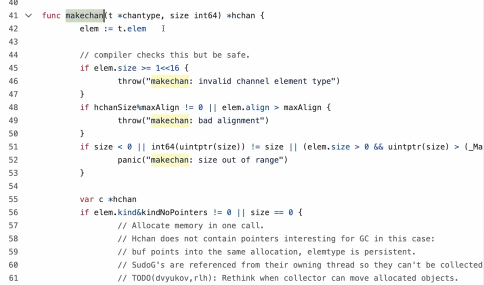
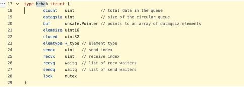
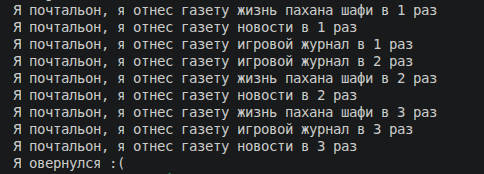

**Главная страница:** [[Ссылки на темы]]

WaitGroup  нам нужна,чтобы дожидаться конкретного выполнения горутин, и когда только все эти горутины завершатся  идти дальше по main 
У нас по идее есть каналы для синхронизации этого всего, но иногда бывает,что горутина ничего не возвращает, а просто выполняет там какую-то работу, просто условный почтальон,которого мы посылаем из main() и не ждем,что он нам что-то вернет и как они завершат свою работу мы продолжимся в main
Пока приведу пример: у нас есть функция postman,которая 3 раза доставляет тот или иной журнал(text string который в аргументе), канал эта функция не принимает, туда мы ничего не записываем , поэтому если эту функцию запустить как горутину, то прога завершится неначавшись:
```go
package main

import (
	"fmt"
	"sync"
	"time"
)

func postman(text string) {
	for i := 1; i <= 3; i++ {
		fmt.Println("Я почтальон, я отнес газету", text, "в", i, "раз")
		time.Sleep(250 * time.Millisecond)
	}
}

func main() {
	go postman("новости")
	go postman("игровой журнал"
	go postman("жизнь пахана шафи")
}
```
Чтобы этого избежать,надо использвать WaitGroup:
```go
wg := sync.WaitGroup{}
```

WaitGroup это структура с полями какими-то, поэтому если мы хотим,чтобы WaitGroup использовалась во всех горутинах, а не ее копия(если будет копия,то понятное дело ничего не заведется), то ее надо передавать по указателю
Почему по указателю, ведь канал не надо было передавать по указателю,а в случае с sync группой мы уже должны об этом задумываться?  
Для этого надо обратиться к исходному коду go


на самом деле,когда инициализируется канал через make(), у нас через куча слоев абстракции вызывается конструктор,что находится на фотке выше, и как видно оттуда, возвращается у нас указатель на структуру канала(фото ниже) 


И получается,что когда создается канал ch := make(chan ...) у нас на самом деле ch это указатель на канал, и когда в функции мы в качестве аргумента прописываем канал, мы передаем туда указатель на канал

Но у sync.WaitGroup{} этого нет, поэтому тут уже надо через указатель 

Пока приведу код, объяснение по всему будет ниже него:
```go
package main

import (
	"fmt"
	"sync"
	"time"
)

func postman(wg *sync.WaitGroup, text string) {
	defer wg.Done()
	for i := 1; i <= 3; i++ {
		fmt.Println("Я почтальон, я отнес газету", text, "в", i, "раз")
		time.Sleep(250 * time.Millisecond)
	}
}

func main() {
	wg := sync.WaitGroup{}
	wg.Add(1)
	go postman(&wg, "новости")
	wg.Add(1)
	go postman(&wg, "игровой журнал")
	wg.Add(1)
	go postman(&wg, "жизнь пахана шафи")
	wg.Wait()
	fmt.Println("Я овернулся :(")
}
```

Вот в main() мы объявили нашу wg := sync.WaitGroup{}, далее, перед каждой горутиной добавляем  `wg.Add(1)`, этим мы говорим программе "скоро будет горутина, повысь счетчик на 1", и так еще 2 раза, так как у нас горутин 3 штуки, пока не будет wg.Wait(), у нас таким образом блокается прога, пока счетчик, который сейчас у нас равен 3, не будет равным 0
Теперь поговорим о функции postman(), в ней в качестве аргументы мы передали переменную wg, которая является указателем на sync.WaitGroup(в main() в горутинах мы и передали &wg), в теле функции в конце должен стоять wg.Done(), этим мы говорим,что горутина завершила свою работу и можно счетчик уменьшать на 1(хорошей практикой является прописывать его через я defer )
И вот, счетчик стал =0 внутри WaitGroup{}, и прога идет дальше(ну там у нас 1 вывод, программа завершается )

Как видно из вывода, все горутины успели выполниться