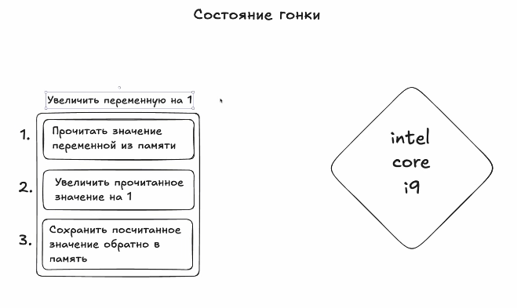
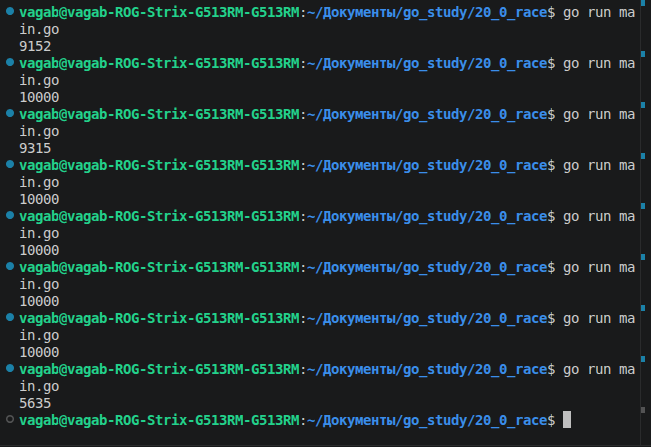
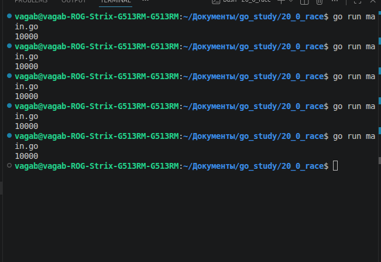
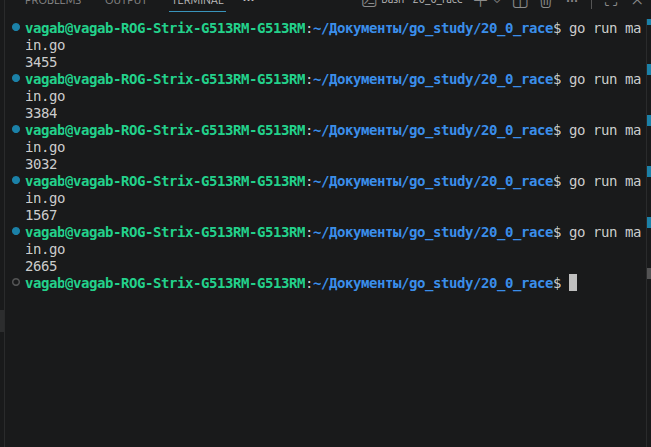

**Главная страница:** [[Ссылки на темы]]

В общем это не очень хорошее явление, которое сигнализирует об ошибке в коде, но чтобы разобраться что это, давайте сначала разберемся,как увеличивается в процессоре значение на 1 


Первым делом надо прочитать значение инкрементируемой переменной из памяти, вот например у нас `number := 2`, чтобы ее инкрементировать, процессор первым делом читает ее из памяти и сохраняет в регистр(кто хоть прикасался к ассемблеру вспомнили про mov)  , вторым шагом он увеличивает на 1(а вот тут я вспомнил про add ) и далее сохраняем обратно в память 

Под капотом операция сложная, да, но что с этого? А то,что если несколько горутин работают с одной переменной возникает состояние гонки, то есть несколько горутин одновременно хотят увеличить значение переменной той же number на 1; Вот берет первая горутина number и закидывает в пямять, вторая делает то же самое, увеличивает на 1( = 3 теперь), вторая также, и возвращает в память, как и вторая, должно было получиться 4, а получится в итоге 3. Почему так? А все просто, горутины работали с одним значением и по сути независимо друг от друга, обе взяли 2, обе увеличили на 1, обе вернули 3. Так-то состояние гонки по большей части не всегда может возникнуть, но оно выскакивает абсолютно рандомно, поэтому непонятно ,как оно себя поведет, это зовется неопределенным поведением 

Как с этим бороться мы то рассмотрим, но пока продемонстрируем состояние гонки:
```go
package main

import (
	"fmt"
	"sync"
)

var number int = 0

func increase(wg *sync.WaitGroup) {
	defer wg.Done()
	for i := 1; i <= 1000; i++ {
		number++
	}
}

func main() {
	wg := sync.WaitGroup{}
	wg.Add(10)
	go increase(&wg)
	go increase(&wg)
	go increase(&wg)
	go increase(&wg)
	go increase(&wg)
	go increase(&wg)
	go increase(&wg)
	go increase(&wg)
	go increase(&wg)
	go increase(&wg)
	wg.Wait()
	fmt.Println(number)
}
``` 

Ну тут обычная прога с инкрементом в качестве функции, ну и да, WaitGroup, чтобы все горутины успели отработать, итог этого ниже:
Должно было стабильно выдавать 10000, но в итоге выдает иногда числа <10000, это как раз из-за того самого состояния гонки и это может доставить на самом деле кучу проблем;  допустим у нас в приложении вышел чей-то пост и миллион пользователей одновременной ставят лайк, сколько в потенциале может лайков потеряться. Что же можно сделать?

## Атомики

Они из себя представляют отдельные переменные, работа с которым в процессоре вынесена в отдельные модули, благодаря чему сложные операции разбиваются на односоставные, благодаря чему невозможно состояние гонки

В коде она объявляется так:
```go
var number atomic.Int64
```

Из себя представляет структуру,то есть number теперь это экземпляр структуры, причем нулевой по значению

И пользуясь методами atomic увеличиваем значение на 1:
```go
func increase(wg *sync.WaitGroup) {
	defer wg.Done()
	for i := 1; i <= 1000; i++ {
		number.Add(1)
	}
}
``` 

Ну и чтобы вывести значение используем:
```go
number.Load()
```

Итог у нас такой:

И сколько бы мы не запускали, у нас всегда будет 10000

Почему? Потому что сложение/ вычитание в  atomic реализовано на аппаратном уровне в одну слитную операцию, иными словами сложение стало атомарной операцией, единой, цельной , нерушимой операцией  

Но атомики довольно тяжелые, когда int легковесный, поэтому надо понимать что и когда использовать

## Мьютексы

Теперь представим, что нам надо производить какие-то операции над слайсами, допустим также при каждой иттерации  раз мы будем туда класть новый элемент(если что наши 10 горутин остаются):
```go
var slice []int

func increase(wg *sync.WaitGroup) {
	defer wg.Done()
	for i := 1; i <= 1000; i++ {
		slice = append(slice, i)
	}
}
```
 И в конце будем выводить длину слайса `len(slice)` 

В теории должно быть 10000 элементов, но в реальности так:


То есть, далеко не все элементы добавляются, так как добавление нового элемента в слайс это еще более сложная операция, нежели чем прибавление единички на 1, и получается,что состояние гонки встречается гораздо чаще, и для того,чтобы подобные критические секции обработать существуют мьютексы:
```go
var mtx sync.Mutex
```

Мы получается находим критическую секцию(тело цикла в нашем случае) и говорим остальным горутинам прекратить работу в этой секции, пока там работает другая какая-то горутина,это делается так:
```go
mtx.Lock()
slice = append(slice, i)
mtx.Unlock()
```
мы получается блокируем критическую секцию до начала каких-то действий, и заканчиваем, как действия закончились 
Если подробнее,то у нас запускается кучу горутин и попадают в случайном порядке в функцию increase(),  и первая горутина, которая попадет на строчку с `mtx.Lock()` возьмет на себя блокировку этого мьютекса и продолжит выполнение критической секции, все горутины которые также попадут в 19 строчку также попытаются взять на себя блокировку мьютекса, но у них не получится, так как блокировка уже была взята и они будут ждать, когда блокировка уйдет, после какая-то другая горутина возьмет на себя блокировку и так далее, то есть с помощью мьютекса мы выстраиваем нашу горутину в очередь и добавление в слайс будет происходить последовательно(весь остальной код параллельно,только критическая секция последовательно )

В итоге запишутся наши 10000 значений в слайс 