Давайте представим,что разрабатывается приложение для такси, где таксисты могут находить пользователей, а пользователи таксистов. Получается у нас есть таксисты и пассажиры, которым нужно куда-то доехать

А теперь представим,что нашим приложением пользуется 10000 таксистов и 10000 пассажиров 
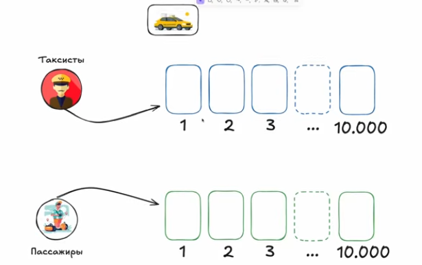

Каждый прямоугольник представляет из себя смартфон какого-то отдельного пассажира или таксиста  

Теперь представим,что какой-то пассажир захотел сделать заказ на своем смартфоне, вбил точку А, вбил точку Б. Получается, таксисты должны узнать о том,что пассажир сделал у себя на телефоне заказ и получается они должны выбрать, принять заказа или нет. В итоге имеем то,что таксисты должны узнать о том,что пассажир нажал что-то там у себя, тоесть запрос, который у себя ввел пассажир должен узнать у себя на телефоне таксист, причем не один таксист, а несколько таксистов

## Сетевой запрос
Теперь вопрос, как реализовать то,чтобы то,что нажимает у себя пассажир, знали не один, а несколько таксистов. Они же могут находится не то что в разных районах города одного, они могут находится в разных городах, как вообще информация с телефона пассажира, должна доходить до таксиста. Ответ прост, информация эта ходит по сети, а точнее происходит сетевой запрос 

Теперь надо разобраться,что такое сетевой запрос, а если говорить в общем,что такое сетевое взаимодействие. Сетевое взаиможействие - это когда 2 устройства, находясь физически далеко друг от друга, могут получать друг от друга информацию. Как это происходит? Допустим пассажир заказывает такси у себя дома, у него дома есть wifi роутер, он что-то нажимает у себя на телефоне и нажимает кнопку "заказать такси", тогда его смартфон передает информацию по роутеру(по воздуху) , роутер принимает эту информацию и по кабелю через кучу всякой апаратуры передает эту информацию в сотовую вышку. В свою очередь таксист, который проезжает мимо этой сотовой вышки, ловит сигнал, и информация о том,что пассажир нажал у себя кнопку  "заказать такси" передается ему. И также в обратную сторону : таксист нажимает "принять заказ", эта информация идет обратно в сотовую вышку(откуда у него wifi,он же в машине), вышка потом по проводам,через кучу аппаратуры, передает эту информацию в роутер, а роуте отправляет информацию о принятии заказа обратно на телефон пассажира. Это все и есть сетевоке взаимодействие, когда 2 физически разных устройства находясь на расстоянии друг от друга могут между собой обмениваться информацией без физического контакта 

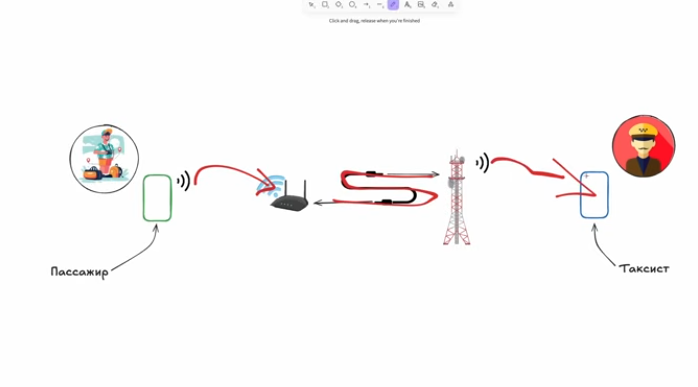

Получается,что когда пассажир хочет сделать заказ, он отправляет запрос на все устройства таксистов,для того,чтобы оповестить этих таксистов,чтобы сделать заказ. В свою очередь таксисты отфильтруют по тем или иным критериям(долго ехать до пассажира, далеко ехать из точки А в точку Б), но найдется какой-то таксист,который примет наш заказ. А это в свою очередь значит,что устройство таксиста должно дать ответ устройству пассажира,что заказ принят, с другой стороны это значит,что смартфон тасиста должен отправить запросы остальным телефонам таксистов,что этот заказ занят и они могут не пытаться его принять. И по итогу, так со всеми смартфонами(делается заказ,отправляются запросы о желании сделать заказ, кто-то его принимает, отправляется ответ пассажиру,что его заказ кто-то принял, и запрос остальным таксистам,что заказ занят) 
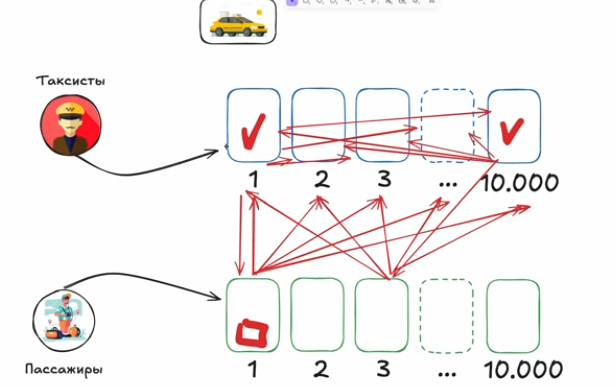

И если вычислять количество опреций,то потенциально у нас может генерироваться до 10.000 x 10.000 = 100.000.000 операций и это прям очень много, учитывая,что сетевой запрос это огромный путь(выше описывал, как оно идет ). И встает вопрос, что делать то, операций много,но по-другому никак. Это еще мелкий какой-то сервис, теперь предствим Яндекс.Такси с их масштабами, так может быть милллионы пассажиров и сотни тысяч такситов  и число операций многократно увеличивается, это первая проблема, а вторая проблема состоит в том,что это все очень сложно разрабатывать. Сложно отследить заказ, который делает пассажир,сложно принять и обработать запрос, сложно обработать ситуацию, когда оба таксиста делают подтверждение заказа одновременно,что делать в этот момент,как они друг с другом договорятся. Это все вызывает много вопросов, много казусов во время разработки, поэтому придумали, как лучше организовывать межсетевое взаимодействие, когда число пользователей потенциально может быть очень большое 

## Клиент-Серверная архитектура
Поэтому умные люди придумали слелующую схему : теперь пассажиры и таксисты не общаются друг с другом напрямую, они теперь общаются через общий удаленный сервер. Как теперь будет выглядить взаимодействие между устройствами? Пассажир хочет сделать заказ, и этот запрос идет на сервер, сервер эту информацию принимает и переваривает. Сервер знает положение каждого таксиста и он смотрит по геолокации местоположение каждого таксиста и выбирвет, какие из них лучше всего подойдут пассажиру, он делает предложение одному из выбранных таксистов и таксит решает, принимать заказ или нет 
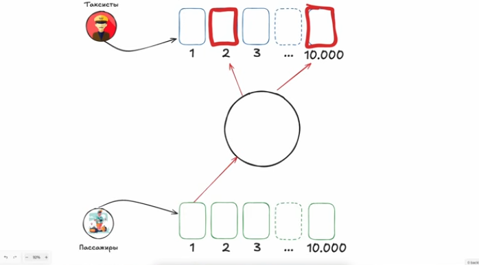

И тут уже видно огромное преймущество при такой организации сетевого взаимодействия: во-первых, теперь все остальные таксисты и все остальные пассажири избавлены от необходимости знать, кто какой заказ сделает, всю эту ответственность на себя теперь берет сервер, а точнее backend-сервер.

Backend предствляет из себя подкапотную реализацию нашего такси-сервиса. Сам по себе backend переводится как задняя часть, но по факту это логика, которая вертится на сервере. К этому бекенду подключаются уже все остальные устройства для межпользовательского взаимодействия(а я напомню, у нас что таксисты, что пассажиры это пользователи нашего приложения) 

Ну все, предствим один из водителей подтвердил заказ, теперь все что нужно сделать -  это отправить на backend информацию о том, что заказ подтвержден, backend сам даст ответ,что заказ подтвержден, а другому такситу(который не успел принять заказ) backend отошлет информацию о том,что заказ был принят 
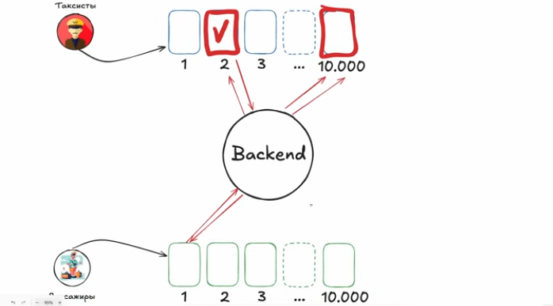

Теперь представим еще ситуацию, еще один пользователь заказывает такси, запрос идет в backend, сервер находит таксистов, которые подходят по параметрам. Но в то же самое время, в том же самом месте еще один пользователь делает заказ с такими же параметрами(класс такси и тд). И этот заказ пошел тем же самым таксистам на предложение. Один таксист принимает заказ первого пользователя, и посылат ответ о том,что заказ принят, в то же самое время, бекенд дает понять другому пользователю,что заказ принят уже и он за ним не приеедет. Но заказ принимает другой таксист, идет ответ на бекенд и бекенд отправляет информацию пользователю о том,что его заказ принят
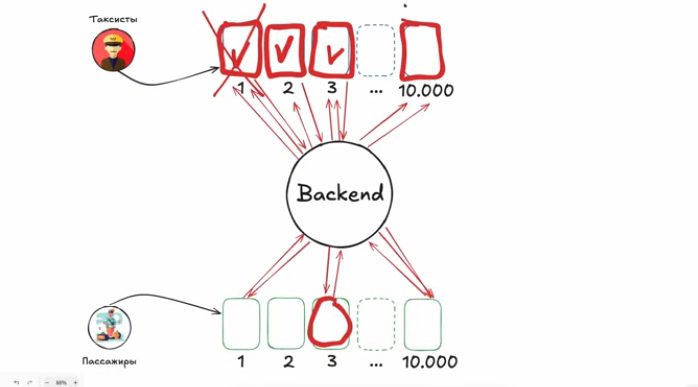

Теперь у нас самая худшая ситуация - это когда одновременно 10.000 пассажиров делают заказ и этот заказ подходит всем таксистам(вероятность такого ничтожно мала), и бекенд посылает эти приложения всем таксистам. Получается,что теперь у нас будет сетевых запросов не 100.000.000, а 10.000+10.000 = 20.000(пассажир-сервер, сервер-водители). И таким образом раз меньше сетевых взаимодействий,следовательно и выше скорость 

Такая организация приложения называется клиент-серверная архитектура, и в нашем мире она наиболее популярна. У нас есть backend-сервер и клиент(для яблока, винды, линукса и тд), и все эти клиенты взаимодействуют с сервером, а сервер в свою очередь дает информацию клиентам. Ну и backend не только для межсетевого взаимодействия нужен, он также хранит у себя всю информацию. Теперь из этого всего понятно,что будем разрабатывать,а именно backend( это для тех,кто по рандому выбрал язык для изучения). 

## HTTP
Но причем тут HTTP?  Дело в том,что сетевой запрос это очень сложно, так как чтобы информация передалась, она должна пройти путь как Одиссей из Трои домой и обратно также. Но в вебе уже не надо знать о том,как устроен роутер, как устроена вышка, так как у нас есть HTTP.

HTTP - это протокол,который  позволяет нам делать запросы не задумываясь о том, как будет этот путь через все это железо проходить. Получается, мы можем сделать запрос на бекенд сервер,не задумываясь о пути(ща пока писал вспомнил экз по сетям, где надо было делать проилюстрировать запрос на http сервак на бумаге). Протокол уровня L7, чего там. 

Из чего же состоит HTTP запрос? Пассажир чтобы заказать такси должен сделать запрос на backend, ему не надо думать о том, как потом backend будет обрабатывать всю эту инфу. Backend'ов у нас может быть много, на одном развернут ютуб,на другом вк, на третьем яндекс го, и нам допустим надо заказать такси. Как же понять,куда именно делать запрос? И первый аопрос, который у нас встает, как у клиента - это куда же делать запрос? За это отвечает IP адрес сервера, он есть у каждого сервера. С помощью него мы можем регулировать, куда именно нам надо делать запрос. Тоесть,если нам надо заказать такси,мы берем ip адрес Яндекс.Такси и делаем по нему запрос. 
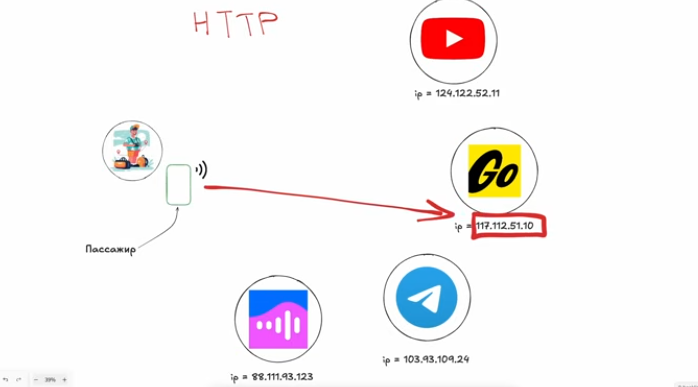

Но как мы узнаем IP адрес того же ютуба, мы же в поисковую строку что-то типа "youtube.com".  На самом деле, изначально мы делаем запрос в DNS(Domain Name System). DNS представляет из себя  систему, которая преобразует домен в ip-адрес, тоесть, за каждым доменом закреплен какой-то ip адрес. Происходит это так: вводитс доменное имя, делается запрос на DNS сервер, DNS-сервер берет ip и уже по нему делается запрос c йстройства. Можно конечно делать запрос сразу на какой-то ip-адрес, но для этого надо знать этот самый ip-адрес. Иллюстрация ниже(пошли уже мои)
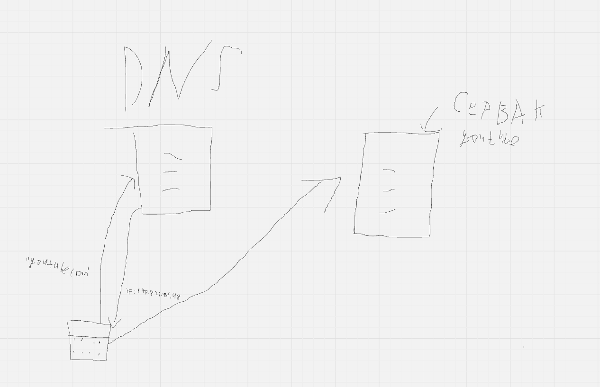

Получается для запроса первое,что нам нужно знать - это домен и ip- адрес

Еще пример, допустим нам надо сделать какой-то запрос на сервак сбера.  Но загвоздка в том,что у сбера может быть на одном сервере запущено сразу несколько сервисов, не обязательно под каждый сервис иметь отдельный сервак.  Сам из себя сервер представляет обычный пк, где есть по для обработки запросов, поэтому если ресурсы позволяют, то на одном серваке можно хранить сразу несколько сервисов(просто не выгодно под каждый покупать отдельное железо).  

Допустим на этом серваке у нас запущен сам банк сбербанка, сберзвук и сбермаркет,  ip-адрес мы тоже узнали,но это адрес сервака:
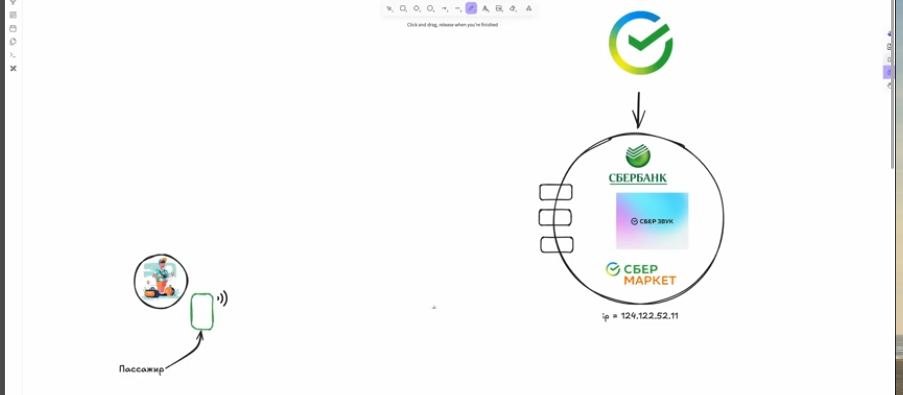

Как же нам сделать так,чтобы запрос пошел именно в условный СберМаркет? Для таких ситуаций придумали порты, они как раз на иллюстрации изображены в виде прямоугольников. На первом порту у нас сбербанк, на втором сберзвук и на третьем нужный нам сбермаркет. И портов у нас может быть не 1,2 или 3, а целых 65535. Часть портов занято ОС, часть другими приложениями,но в большинстве своем эти порты открыты и на них можно завязываться. 

Получается, нам надо помимо ip-адреса еще и порт, на котором расположен нужный нам сервис, вид получается пока какой-то такой: `148.822.81.48:333`, тоесть через двоеточие надо указать порт. И меняя этот порт, можно в теории переключаться между сервисами, которые расположены на серваке по нашему ip-адресу. Повторюсь, это надо чтобы сэкономить, не выгодно покупать под каждый сервис отдельный сервер, выгоднее один собрать, который будет их тянуть, и на нем держать  сервисы, а переключаться по ним можно через порты. 
Получается, для http запроса нам нужен 1) домен и ip-адрес; 2)  порт; 
Откуда взять порт? Дефолтный порт для http - 80, а для https - 443.
Значит ,на данном этапе у нас принцип работы такой: с устройства отправляется запрос на dns-сервер, нам возвращается ip-адрес,  и браузер попытается сделать запрос по 443 порту, так как https  - стандарт для браузеров, если ничего не получилось, то он сделать запрос по 80 порту(через http). МОжно еще использовать свои кастомные порты, но если на них ничего нет, по -умолчанию запрос будет посылаться на 80 или 443 порты. Но сетевые запросы могут быть не обязательно с браузера или клиента, это все может делать и сервер, точнее делать запросы на другие сервера
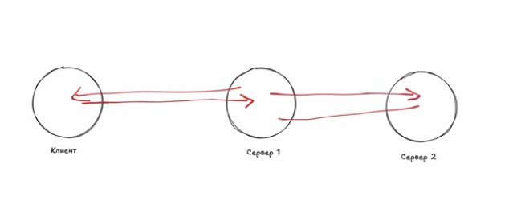

Тоесть, наш сервер может быть как сервером для обработки клиентских запросов, так и клиентом, который посылает на другой сервер запросы  и принимает от него ответы. Как это работает?

Вот у нас пассажир заказыват такси, делает запрос на сервер яндекса,а конкретно на яндекс.такси. Наше клиентское приложение в свою очередь знает ip-адрес и порт, где находится сервис яндекс.такси .  Потом сервер под капотом поработал и дал ответ таксисту, таксист принял заказ и нажал на кнопку "заказ окончен". Этим действием он спровоцировал запрос на сервера Яндекс, а конкретно на Яндекс.Такси(по порту), мол заказ закончен, а раз заказ закончен, надо списать деньги, но кому эту операцию можно доверить? По сути, сервису связанному с деньгами, таким может быть, допустим,Сбербанку. И мы с сервера Яндекс.Такси  делаем запрос серверу Сбербанка, а конкретно тому порту, где находится сервис для манипуляций с деньгами. И попадая на приложение Сбербанка, просим его списать деньги. После того, как деньги списались,у нас посылается ответ сервису Яндекс.Такси о том,что деньги списались. Обязательства о том,что списалисбь деньги на себя может взять Сбербанк(грубо говоря отправить уведомление о списании денег). 
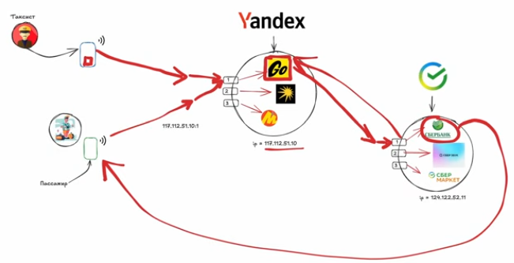

Получается, важен сам факт запроса, если так подумать. Если ты инициируешь запрос, то ты клиент, если ты принимаешь запрос, то ты сервер, но в следующую секунду сущность,которая была сервером, может стать клиентом, так как отправлят данные на другой сервер и ждет от него ответа.

Вообще HTTP - протокол устроен так, что мы можем отправить запрос, подождать условно секунд 30, и если ничего не придет, то запрос будет считаться неуспешным. Это правило вшито в протокол, если делаем запрос, то дальше идти не можем, пока не придет ответ, также и у сервера, когда пришел запрос, мы не можем когда-то потом отправить ответ, его надо отправить как можно быстрее. 

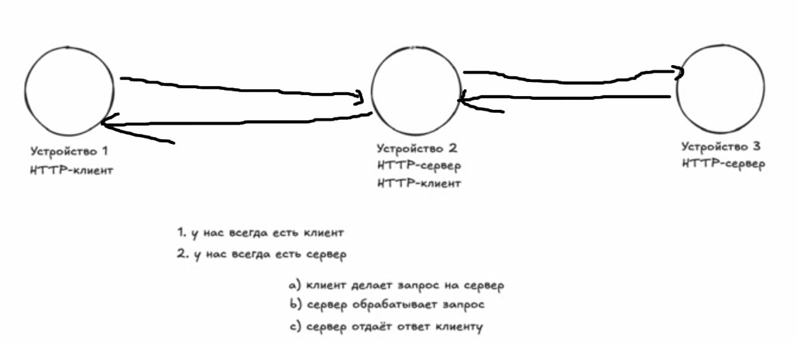

