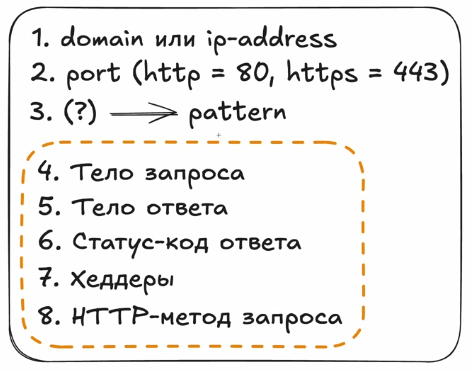
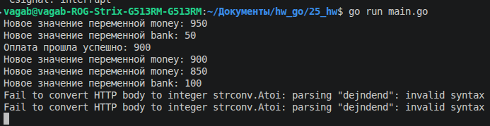
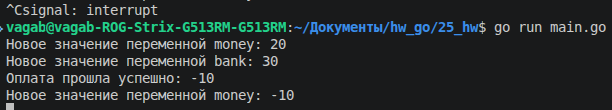
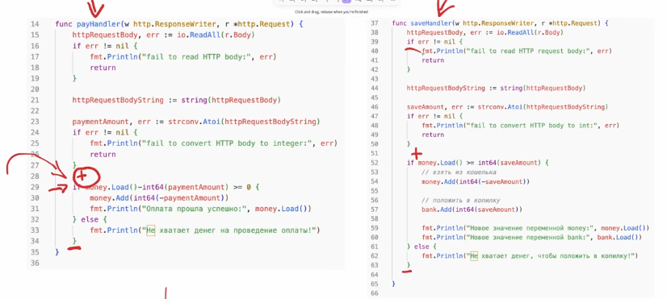

Чтобы полноценно пользоваться протоколом HTTP недостаточно знать только домен/ip-адрес, порт и патерн,надо знать еще о некоторых характеристиках: тело запроса, тело ответа, статус-код ответа,хеддеры и http-метод запроса


Сейчас будем разбирать тело http запроса. Для примера возьмем какое-то максимально упрощенное приложение управления кошельком


Нам изначально будет дан какой-то баланс, который будет лежать в переменной money, также нам будет дана переменная bank - это наша копилка. У нас будет 2 хендлера, кооторые позволят нам совершать какие-то манипуляции с кошельком. Первый хендлер - `/pay`, он будет позволять пользователю что-то купить, в нашей реализации будет просто вывод что-то типо "вы купили что-то" и сниматься деньги с переменной money(просто переменная будет понижать свое значение). Второй хендлер - `/save`, он будет откладывать наши деньги 

Вот мы объявии наши хендлеры хендлеры, задали эндпоинты и объявили север
```go
package main

import (
"fmt"
"net/http"
)

var money int = 1000 // usd
var bank int = 0 // usd

func payHandler(w http.ResponseWriter, r *http.Request) {

}


func saveHandler(w http.ResponseWriter, r *http.Request) {

}

func main() {
http.HandleFunc("/pay", payHandler)
http.HandleFunc("/save", saveHandler)

err := http.ListenAndServe(":1488", nil)
if err != nil {
	fmt.Println("err:", err.Error())
}

}
```

Вот надо нам снять денег, например, как нашему payHandler() понять,на какую суммы мы снимаем денег, ответ: никак, так как у нас нет никакой информации в payHandler()  о том,что именно мы покупаем. Чтобы у нас появилась информация  о том, что покупать, нам как раз и нужно тело запроса. 

Для иммитации запроса возьмем постман, выбираем body -> raw и у нас открывается некая область,куда можно вводить текст, там мы можем передавать как раз входящие запросы. 

А как в программе получить это значение? Для этого нужно обратиться к `r *http.Request`, так как этот аргумент содержит всю информацию о входящем запросе. Прочитать его можно так: `httpRequestBody, err := io.ReadAll(r.Body)`. Метод `io.ReadAll(r.Body)` принимает в себя какой-то []byte, через `r.Body` можно получить тело запроса.  

Пару слов скажу о []byte. byte - это буквально байт,тоесть по сути какие-то двоичные числа, так как у нас слайс,то получается у нас в этом слайсе могут быть только какие-то двоичные числа. А я напомню,что байт=8 бит, а бит = 0/1, тоесть 1 байт из себя представляет что-то типа 10010011, а в слайсе байт подобного много. Но почему когда из постмана мы посылаем какую-то строку, нам приходит какой-то []byte?
Это вызвано тем,что когда мы делаем запрос с postman на наш сервер go, у нас запрос должен пройти по сети. А самый быстрый способ передавать данные по сети - это их передача в двоичном виде, поэтому,когда мы в postman отправляем какой-то запрос на сервер, мы отправляем именно []byte. 

Теперь о том, как перевести этот []byte в данные,с которыми можно работать. Это можно сделать через несколько спобов,но один из них - это перевести []byte в  строку,а строку потом через `strconv.Atoi(httpRequestBodyString)` перевести в число, этот метод вообще возвращает еще и ошибку, так что надо будет и ее обработать, После всего этого можно уже отнять число,что пришло с запроса от money
```go
func payHandler(w http.ResponseWriter, r *http.Request) {
	httpRequestBody, err := io.ReadAll(r.Body)
	if err != nil {
		fmt.Println("err:", err)
		return
	}
	httpRequestBodyString := string(httpRequestBody)
	paymentAmount, err := strconv.Atoi(httpRequestBodyString)
	
	if err != nil {
		fmt.Println("Fail to convert HTTP body to integer", err)
		return
	}
	money -= paymentAmount
}
```

Вообще тут есть пару моментов,которые надо править. Как мы помним, у нас для каждого хендлера при запросе запускается отдельная горутина,это значит,что к переменной monet иммеют доступ сразу несколько переменных,значит эту переменную надо обработать серез мьютексы или атомики.

Вобще,если стоит выбор между тем,использовать мьютекс или атомики, то надо смотреть на то,что писать легче и дешевле. Мьютексы сами по себе операция недешевая, структура сложная, поэтому в этом случае лучше через атомики делать. 

Также,чтобы не уйти в минус,надо сделать проверку,больше ли значение money той суммы,что мы отнимаем

```go
var money atomic.Int64 // usd
var bank int = 0 // usd

func payHandler(w http.ResponseWriter, r *http.Request) {
	httpRequestBody, err := io.ReadAll(r.Body)
	if err != nil {
		fmt.Println("err:", err)
		return
	}
	httpRequestBodyString := string(httpRequestBody)
	paymentAmount, err := strconv.Atoi(httpRequestBodyString)
	if err != nil {
		fmt.Println("Fail to convert HTTP body to integer", err)
		return
	}
	
	if money.Load()-int64(paymentAmount) >= 0 {
		money.Add(int64(-paymentAmount)) // у атомиков нет метода,который уменьшает значение переменной
		fmt.Println("Оплата прошла успешно:", money.Load())
	}
}

func main(){
	money.Add(1000) // инициализируем количество денег тут,так как через атомик это делать нельзя
}
```

Теперь перейдем к описанию хендлера `saveHandler(w http.ResponseWriter, r *http.Request)`. В плане описания, там по сути ничего нового,единственное что помеенялось,у нас теперь сравнивается не на разность больше нуля, а на то,что значение денег больше чем значение,которое мы хотим положить в копилку(если так подумать,то тоже самое).

```go
func saveHandler(w http.ResponseWriter, r *http.Request) {
	httpRequestHandler, err := io.ReadAll(r.Body)
	if err != nil {
		fmt.Println("err:", err)
	}
	
	httpRequestString := string(httpRequestHandler)
	saveAmount, err := strconv.Atoi(httpRequestString)
	if err != nil {
		fmt.Println("Fail to convert HTTP body to integer", err)
		return
	}
	
	// взять из кошелька
	if money.Load() >= int64(saveAmount) {
		money.Add(-int64(saveAmount))
		
		// положтить в копилку
		bank.Add(int64(saveAmount))
		fmt.Println("Новое значение переменной bank:", bank.Load())
	} else {
		fmt.Println("Недостаточно средств для проведения операции")
	}
}
```

И по идее оно должно работать и спойлер,оно будет работать.



Но это на первый взгляд, на самом же деле, если на сервер будет идти большая нагрузка,если несколько человек попытаются одновременно взаимодействовать с приложением,будет ошибка, о которой я сейчас скажу.

Предствим у нас на балансе 50usd, потом какой-то пользователь захочет оформить какую-то покупку на 30usd , и следовательно будет запрос на payHandler(), в этот же момент другой клиент захочет положить 30usd в копилку, от чего будет запрос на saveHandler()(просто условно пусть будет общий кошелек). А я напоминаю,при запросе у нас каждый хендлер это отдельная горутина, и вот, совершают эти пользователи одновременно свои запросы и получается,что в момент проверки у нас сравнение происходит с 50usd и оба хендлера проходят свои проверки и получается такая ситуация,что деньги списали уже за покупку, вернулось я 20usd, и потом далее деньги ставятся на кошелек, и у нас получается,что переменная money = -10usd, а такого быть не должно.  Тоесть из-за параллельного выполнения кода из хендлера может такая ситуация вполне быть,особенно,опять же, если проверки в горутине происходят едимоментно. (имитировал тем,что добавил задержку во время выполнения программы)
 
И получается,что у нас возникает проблема гонок данных, тольк не н уровне какой-т переменной,а не уровне целой операции. По-хорошему, у нас должна была сначала пройти оплата, а только потом уже проверяться, можно ли в копилку закинуться деньги, и наоборот.  И нам надо заставить горутины как-то выполняться эти операции по очереди,чтобы сначала у нас шла операция снятия денег,а потом уже,если есть возможность, операция закладывания денег в банк, чтобы не было потом проблем с данными, поэтому надо взять блокировку по мьютексу в этих секциях(+: взятие блокировки, -: снятие блокировки)

Вообще, видение всех этих критических секций- это опыт, тут в данном случае работает так: мы смотрим, какие переменные где используется, все переменные,кроме переменной money, используются в рамках одной секции,переменная money же используется сразу в двух горутинах и тут манипулиции с атомиком могут не сработать так как переменная money в payHandler() и saveHandler(), и надо насторожиться, так как у нас еще и работа с общими ресурсами идет.  И тут надо прикинуть,что может произойти при одновременной работе этих двух кусков кода.Ну мы прикинули, поняли,что может вернуттся неправильное значение и обкладываем эту секцию мьютексом.Теперь у меня последовательно будет выполняться сначала одна,а потом вторая секция.Раз мы изолировали работу переменной мьютексом, можно убрать атомики, так как вся работа с переменной изолирована в мьютексе 