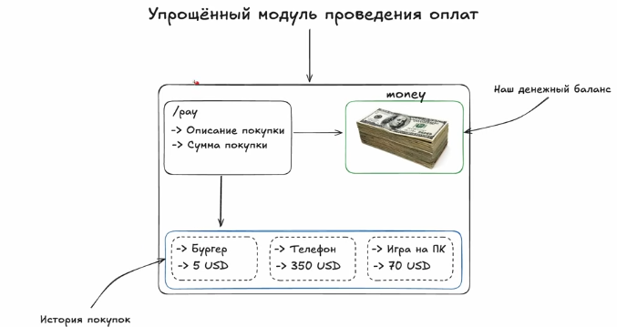

JSON,как и все,что мы прошли до этого,это в первую очередь инструмент,который решает какую-то задачу. Проще объяснить на приемере.


Представим,что мы описываем backend приложение, которое является модулем проведения оплат(рассмотрим упрощенный пример).  У нас будет в нашем приложении один единственный эндпоинт, который принимает 2 значения: 1) описание покупки 2) сумма покупки. Тоесть,если наш пользователь захочет сделать запрос на модуль проведенения покупки(запрос по эндпоинту /add), надо ему передать описание покупки и сумму покупки. Благодаря чему мы будем знать,что именно хочет пользователь и сумму покупки. Сумма покупки будет списываться с денежного баланса,который представлен переменной money.Также все наши покупки будут сохранены в историю покупки(допустим пользователь купил игру на пк и это у нас отложилось в историю покупок, нижняя секция на картинке).

Мы объявляем переменную money,хендлер оплаты, инициализируем этот хендлер с эндпоинтом в main(), там же запускаем сервер. 
```go
package main

import (
"fmt"
"net/http"
)

var money = 1000

func payHandler(w http.ResponseWriter, r *http.Request) {

}

func main() {
	http.HandleFunc("/pay", payHandler)
	if err := http.ListenAndServe(":1488", nil); err != nil {
		fmt.Println(err)
	}// если переменная используется всего один раз  и там надо обработать ошибку,то можно использовать такой вариант записи,он ограничит область видимости переменной до блока ветвления
}
```
Теперь думаем, как мы могли бы сохранять историю покупок, если так подумать,то это можно сделать через какой-нибудь слайс и объявить структуру,где будет описание покупки. Также надо учитывать,что у нас доступ к переменной будет не только из main горутины,но и из горутины,которая запустится после того,как мы сделаем http-запрос, сделать это можно через мьютекс. 
```go
type Payment struct {
	Description string
	USD int
}
var mtx sync.Mutex
var paymentHistory = make([]Payment, 0)
```

И сейчас стоит такая проблема,что нам теперь надо задавать как-то два значения при запросе,а не одно,как мы делали до этого. В теории,это можносделать так: можно в нашем Body в Postman задать параметры через запятую, как-то так `100, descripton`, далее в коде через `strings.SplitN("строка переданная в запросе", "разделитель(запятая,пробел), "количество элементов,в нашел случае 2,так как в описании могут быть запятые")`, разделить по запятой. Получаится что-то такое : `parts := strings.SplitN(string(httpRequest), ",", 2)`. По сути мы получаем слайс строк с двумя элементами. Также  `strings.SplitN()` не гарантирует,что будет именно 2 элемента в слайсе,если нам передали всего 1 аргумент, поэтому надо будет сделать проверку на длину слайса .
```go
parts := strings.SplitN(string(httpRequest), ",", 2)
if len(parts) != 2 {
	w.WriteHeader(http.StatusBadRequest)
	return
}
```
Далее мы должны перевести наше число в тип данных int, и после этого можно будет создать экземпляр структуры
```go
usd, err := strconv.Atoi(parts[0])
if err != nil {
	w.WriteHeader(http.StatusBadRequest)
	return
}
payment := Payment{parts[1], usd}
```

Далее снимаем деньги,если проверка удаласть и закидываем информацию о покупке в слайс, ну и выводим историю и сколько денег осталось
```go
mtx.Lock()
if money-usd >= 0 {
	money -= usd
}
paymentHistory = append(paymentHistory, payment)

fmt.Println("money:", money)
fmt.Println("payment history:", paymentHistory)
mtx.Unlock()
```

Запускаем программу и проверяем. Если отправить запрос с пустым телом, не теми параметрами или в неправильном формате,то будет `400:Bad Request`, если же отправлять запросы как надо(например: `100,Бургер`), то вывод будет следующим:
```bash
money: 900
payment history: [{Бургер 100}]
money: 750
payment history: [{Бургер 100} {Телефон 150}]
money: 550
payment history: [{Бургер 100} {Телефон 150} {Игровая приставка 200}]
```
Вроде все хорошо,но теперь представим,что в информации о покупке мы теперь захотим хранить полное имя пользователя и адрес 
```go
type Payment struct {
	// Описание покупки
	Description string
	//Сумма покупки
	USD int
	// ФИО
	FullName string
	//Адрес
	Adress string
}
```
Получается теперь нам надо всю эту инфу тоже как-то хранить, можно было бы придумать опять что-то с запятыми, но проблема в том,что адрес тоже хранит в себе запятые. И понять какая запятая разделяющая становится сложнее. А запросы по сути могут быть сложнее,может быть еще больше всякой информации в теле запроса. 
Можно придумать что-то с мапами, например у нас есть ключ и по этому ключу хранится нужная информация:
```text
usd: 200,
description: Игровая приставка,
fullName : ...,
address: ...,
```

А теперь представим,что пользователь купил не один товар,а взял целую корзину, это по идее можно все закинуть в какой-нибудь массив и теперь нам надо обрабатывать массивы.  
```text
[
    usd: 200,
description: Игровая приставка,
fullName : ...,
address: ...,
],
[
    usd: 200,
description: Игровая приставка,
fullName : ...,
address: ...,
],
[
    usd: 200,
description: Игровая приставка,
fullName : ...,
address: ...,
],
```

И все это парсить было бы тяжело, поэтому и нужен JSON.

В свое время умные люди придумали стандарт передачи данных, потому что столкнулись именно с такой проблемой.По сути,это все,что мы сейчас обсудили,только в виде формата данных.

В Postman можно как раз выбрать этот формат в теле запроса. Чтобы передать данные из нашей программы, нужно поле,которому надо передать значение, обернуть в ковычки,поставить двоеточие и после него данные в нужном формате, запрос в формате JSON в нашем случае выглядит как-то так:
```json
{
"description": "Бургер",
"usd" : 100,
"fullName" : "Иванов Иван Иванович",
"address": "г. Париж, ул. Багетная 47"
}
```

Тоесть, к нам в тело запроса придет вот такой вот JSON и нам надо как-то его обработать в хендлере. Для этого надо в структуре добавить запись вида `json:"поле"`,это означает,что мы говорим нашему языку программирования,что если он будет из нашего запроса брать JSON и вводить его в эту структуру Payment{}, то этому полю структуры будет соответствовать это поле JSON
```go
type Payment struct {
	// Описание покупки
	Description string `json:"description"`
	//Сумма покупки
	USD int `json:"usd"`
	// ФИО
	FullName string `json:"fullName"`
	//Адрес
	Address string `json:"address"`
}
```

Теперь мы можем с помощью готовых библиотек брать JSON и преобразовывать  в нужную структуру.  Это можно сделать через функцию `json.Unmarshal("Наш запрос в формате []byte","Переменная,куда мы будем это все записывать")`
И получается,что хендлер стал заметно меньше
```go
func payHandler(w http.ResponseWriter, r *http.Request) {
	httpRequest, err := io.ReadAll(r.Body)
	if err != nil {
		w.WriteHeader(http.StatusInternalServerError)
		return
	}
	var payment Payment
	if err := json.Unmarshal(httpRequest, &payment); err != nil {
		w.WriteHeader(http.StatusInternalServerError)
		return
	} // вот как раз тут мы принимаем и распаршиваем формат JSON
	
	mtx.Lock()
	if money-payment.USD >= 0 {
		money -= payment.USD
	}
	
	paymentHistory = append(paymentHistory, payment)
	
	fmt.Println("money:", money)
	fmt.Println("payment history:", paymentHistory)
	mtx.Unlock()
}
```

Дполнительно можно еще метод структуры описать для вывода полей
```go
func (p Payment) Println() {
	fmt.Println("Description:", p.Description)
	fmt.Println("USD:", p.USD)
	fmt.Println("FullName:", p.FullName)
	fmt.Println("Address:", p.Address)
}
```

Запускаем программу, посылаем запрос и видим ожидаемый вывод;
```go
Description: Бургер
USD: 100
FullName: Иванов Иван Иванович
Address: г. Париж, ул. Багетная 47
money: 900
payment history: [{Бургер 100 Иванов Иван Иванович г. Париж, ул. Багетная 47}]
```

С помощью JSON можно сделать проще,сейчас мы  вычитываем тело запроса вручную,а можно сделать так,чтобы JSON сам принимал тело запроса, декодировал его и значение кидал в переменную payment:
```go
var payment Payment
if err := json.NewDecoder(r.Body).Decode(&payment); err != nil {
	w.WriteHeader(http.StatusInternalServerError)
	fmt.Println(err)
	return
}
```

И если посмотреть на хендлер, становится понятно,насколько теперь легко становится работать с данными:
```go
func payHandler(w http.ResponseWriter, r *http.Request) {
	var payment Payment
	if err := json.NewDecoder(r.Body).Decode(&payment); err != nil {
		w.WriteHeader(http.StatusInternalServerError)
		fmt.Println(err)
		return
	}
	payment.Println()
	mtx.Lock()
	if money-payment.USD >= 0 {
		money -= payment.USD
	}
	paymentHistory = append(paymentHistory, payment)
	fmt.Println("money:", money)
	fmt.Println("payment history:", paymentHistory)
	mtx.Unlock()
}
```
Тоесть,мы берем тело запроса и начинаем его обрабатывать на уровне языка программирования. Вот для этогго и нужен JSON, он помогает тяжелые данные перевести на уровень языка программирования. И  помимо рассмтренных значений он поддерживает bool,array,float64, массивы нескольких сущностей и тд. 

Но у такого подхода имеются минусы. Например,если мы забудем допусти в нашем запросе передать поле "usd", то запрос отправится корректно, просто передав структуре значение по-умолчанию. Тоесть, почему-то потеря входящего поля не расценивается как ошибка. 
Поэтому обычно пишут всякие методы валидации,чтобы такого не было. 

Также мы помимо тела запроса можем описывать всякие тела ответа, раз мы можем передавать данные по сети. Например,мы заходим выводить наши переменный money и paymentHistory не просто в консоль, но и передавать в теле ответа. Для этого моожно создать отдельную структуру, где в качестве полей мы выставим целочисленный money и массив из экземплятов структуры Payment.
```go
type HttpResponse struct {
	Money int
	PaymentHistory []Payment
}
```

После того,как мы обработали данные,мы создаем экземпляр HttpResponse и передаем его полям значения переменных money и paymentHistory. После всео этого мы вызываем функцию `json.Marshal("любая переменная с информацией")`, она переведет информацию в формат json , при этом возвращая формат []byte, ну и потом это все дело можно вернуть через w.Write
```go
httpResponse := HttpResponse{
		Money: money,
		PaymentHistory: paymentHistory,
	}
	b, err := json.MarshalIndent(httpResponse, "", " ")
	if err != nil {
		fmt.Println("err:", err)
		w.WriteHeader(http.StatusInternalServerError)
		return
	}
	
	if _, err := w.Write(b); err != nil {
		fmt.Println("err:", err)
		w.WriteHeader(http.StatusInternalServerError)
		return
	}
	fmt.Println("money:", money)
	fmt.Println("payment history:", paymentHistory)
	mtx.Unlock()
```

Вот вывод из тела ответа:
```json
{
	"Money": 900,
	"PaymentHistory": [
		{
			"description": "Бургер",
			"usd": 100,
			"fullName": "Иванов Иван Иванович",
			"address": "г. Париж, ул. Багетная 47",
			"Time": "2026-09-06T15:07:14.405141414+03:00"
		}
	]
}
```

Кстати,хорошей практикой считается помечать то, как поля структуры, предназначенной для тела ответа, будут представлены в json формате
```go
type HttpResponse struct {
	Money int `json:"mmoney"`
	PaymentHistory []Payment `json:"phistory"`
}
```

От этого у нас и вывод поменялся в теле ответа
```json
{

	"mmoney": 900,
	"phistory": [
		{
		"description": "Бургер",
		"usd": 100,
		"fullName": "Иванов Иван Иванович",
		"address": "г. Париж, ул. Багетная 47",
		"Time": "2026-09-06T15:23:18.867013226+03:00"
		}
	]
}

```