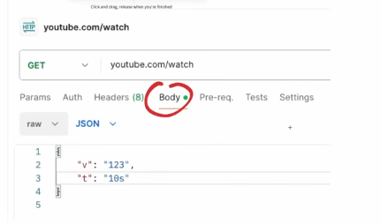
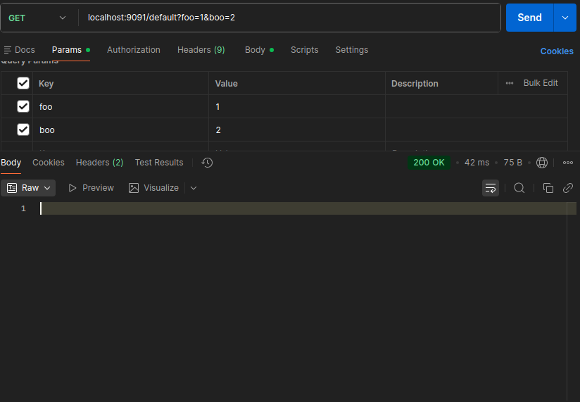

Скоро мы узнаем что такое REST API и напишем небольшое REST API приложение,но пока надо изучить,что такое Query-параметр.  

Query-параметр - это тоже важная и неотъемлемая часть HTTP-протокола, и вообще, параметров HTTP протокола может быть больше,тут то,что мы рассмотрели по сути база.

Рассмотрим пример, у нас есть запрос : `youtube.com/watch?v=4xST8IWJFZc&t=32773s`. Он идет на домен `youtube.com` на патерн `/watch` и потом какие-то непонятные символы. Что тут происходит? А происходиь следующее: мы делаем запрос по домену `youtube.com`,получаем его  ip-адрес, далее так как не указан порт, мы будем пытаться сделать запрос на 443 порт(базовый для https,тоесть,зашифрованное соединение) , мы получили ip-адрес и порт, далее идет патерн `/watch`,это эндпоинт, на который мы делаем запрос, но потом идет знак вопроса и вообще что-то непонятное. Это и есть наш query-параметр, то есть, мы ставим знак вопроса и потом пойдут key=value значения по типу `v=4xST8IWJFZc`, если мы встречаем `&`, то это значит,что закончилась прошлая пара значений и начинается новая, в нашем случае `t=32773s`. Короче, query-параметры, это параметры,которые могут быть,ну или их может и не быть. Благодаря `&` можно сказать где закончилась старая и началась новая, `&` может и не быть,но если он есть,значит наначалась новая пара key=value. 

Но для чего это надо? Это какая-то уточняющая информация для нашего запроса. По сути,то же самое,что и тело запроса, но эта уточняющая информация подается не в теле запроса,а в query-параметре. Но мы же можем эту самую инфу передать в теле запроса,так зачем оно надо, можно же то же самое передать в теле запроса через JSON? 


И в этом есть доля истины, но у тела запроса есть один минус: его надо заполнять через какие-то программы по типу Postman и это не очень удобно. 

Представим такую ситуацию, вот мы смотрим на ютубе видео и там есть какой-то момент, с которым я хочу с кем-то поделиться и мы берем через ссылку им делимся: `https://www.youtube.com/watch?v=4xST8IWJFZc&t=32773s`.Да, это та же самая ссылка,которую я вначале разбирал,но ща подробнее. Вот у нас есть `v=4xST8IWJFZc`, это какой-то идентефикатор видео,  благодаря которому ютуб понимает,какое видео надо открывать, потом у нас идет `&` и `t=32773s`, тут нам передается таймкод видео. Получается, с помощью этих самый query-параметров мы зашили в ссылке ютуба каку-то дополнительную информацию(какое видео я хочу открыть и какой таймкод я хочу открыть). Но почему я не сделал то же самое через тело запроса? Да потому что тогда я бы не мог просто так взять и поделиться этой ссылкой. Надо было бы кидать человеку `youtube.com/watch`, потом говорить ему войти там  в консоль и передавать в теле запроса эти самые v и t. Тогда бы никто не смотрел видосы эти самые, но благодаря тому,что эти идентификаторы зашиты в сам запрос, мы можем делиться видосами и даже таймкодом. 

То есть, по сути для всякой доп инфы это надо, но значит ли это,что мы можем теперь забить на тело запроса? Нет, так как иногда удобнее пользоваться телом запроса, нежели чем query-параметром. Но тут еще один вопрос, когда использовать query-параметром, а когда телом запроса? Вообще, по словам автора, когда захотите, как принято в вашей команде, так и делайте, где-то не юзают query-параметр и юзается чисто тело запроса, где-то наоборот, где-то 50/50. 

Рассмотрим,как это все делается в коде. Опишем запрос вида `localhost:9091/default?foo=x&boo=y`, в хендлере передадим нужные нам query параметры и выведем их на экран
```go
package main

import (
	"fmt"
	"net/http"
)

// localhost:9091/default?foo=x&boo=y

func handler(w http.ResponseWriter, r *http.Request) {
	fooParam := r.URL.Query().Get("foo") // тут и описываем
	booParam := r.URL.Query().Get("boo")
	
	fmt.Println(fooParam)
	fmt.Println(booParam)
}

func main() {
http.HandleFunc("/default", handler)

if err := http.ListenAndServe(":9091", nil); err != nil {
fmt.Println(err)
}
}
```

в Postman это выглядит так:


Вывод в консоли:
```bash
1
2
```

В этих параметрах впринципе можно писать что угодно. 