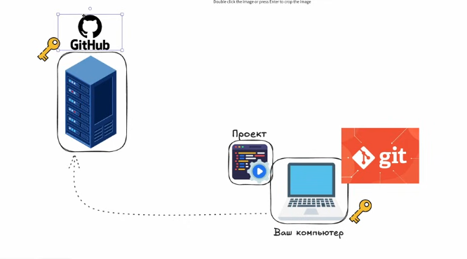
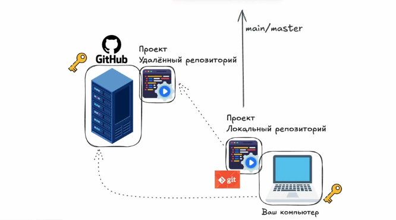
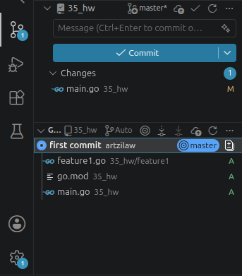

Для начала создаем какой-то проект,код мб вставлять не буду,но по ходу дела части его будут

Кстати,можно открыть vs code через консоль, написав в терминале `code "относитльный путь"`

Чтобы git знал с каким локальным компьютером работать,надо сгенерить ssh-ключ,его можно сгенерить в терминале через команду `ssh-keygen -t rsa` , и он будет хранится в файле с расширением .pub(можно через нано,можно через vim) и сгенеренный ssh добавить в github. Теперь без лишних авторизаций и прочего можно взаимодействовать с серваком github через наш компьютер(я раньше без рофлов каждый раз переавторизовывался,если надо было что-то запушить,потом уже через vs code это все стал делать)

Еще для самого гита важно указать автора всех изменений,это делается так:
```bash
git config --global user.email "ваша_почта@gmail.com"
git config --global user.name "имя_или_что-то еще"
```

а через команду `git config --list` это все можно посмотреть:
```bash
user.name=ваше_имя
user.email=ваша_почта@gmail.com
```

Зачем это надо? В гите каждая строчка принадлежит какому-то автору обычно,соответственно e-mail и имя,которое мы указали,будут указаны в авторстве строчек

Теперь возвращаемся к нашему проекту, мы хотим его загрузить в github. Первым делом мы инициализируем пустой репозиторий github( показывать как это делать не буду), при создании можно добавить readme файл, .gitignore файл. Также можно выбрать каким этот репозиторий будет, публичным или приватным,разница в том,что в приватном репозитории доступ к коду только у меня будет,в публичном он будет доступен каждому в плане чтения,редактировать его смогу только я.  Короче,создаем репозиторий,пока что он пустой,связи с проектом никакой нет

А сейчас пойдет инструкция по тому,как добавлять проект в пустой репозиторий. Для начала инициализируем git-репозиторий, это делается через команду `git init`, таким образом теперь наш проект это еще и локальный репозиторий, но пока еще наш проект репозиторий на серваке github не связаны. Чтобы связать надо ввести команду ` git remote add origin "ссылка_на_репозиторий"`, теперь уже репозиторий в github и на нашем компе связаны. Теперь нам надо все наши файлы с локального репозитория загрузить на репозиторий github,как это сделать? Для начала можно посмотреть что вообще есть в нашем локальном репозитории,это делается комадой `git status`,вот что будет в выводе:
```bash
Текущая ветка: master

Еще нет коммитов

Неотслеживаемые файлы:
  (используйте «git add <файл>...», чтобы добавить в то, что будет включено в коммит)
        feature1/
        go.mod
        main.go

индекс пуст, но есть неотслеживаемые файлы
```
Как мы видим,сейчас мы на самой главной ветке master,  так как мы только создали наш удаленный github-репозиторий


Смотрим далее,у нас написано `Еще нет коммитов`, commit - это по сути та самая фиксация версии, грубо говоря commit- та самая версия,между которой мы можем переключаться. 

Далее терминал пишет `Неотслеживаемые файлы:`, это файлы,которые мы пока не отслеживаем как файлы нашего репозитория. Также там написано `индекс пуст, но есть неотслеживаемые файлы`,  это значит,что в коммит не было ничего добавлено, надо будет добавить эти файлы в коммит. Можно добавить какие-то конкретные файлы в commit, на примере main.go это делается так: `git add main.go ` , теперь git status выглядит так: 
```bash
Текущая ветка: master

Еще нет коммитов

Изменения, которые будут включены в коммит:
  (используйте «git rm --cached <файл>...», чтобы убрать из индекса)
        новый файл:    main.go

Неотслеживаемые файлы:
  (используйте «git add <файл>...», чтобы добавить в то, что будет включено в коммит)
        feature1/
        go.mod
```

Как мы видим, main.go теперь добавлен в commit, можно также добавлять не по одному файлу,а сразу все через `git add .` . Теперь надо сделать сам коммит,чтобы зафиксировать проект в текущей версии, это можно сделать через `git commit -m "любое_название_коммита"` , теперь вот что отображает `git status`:
```bash
Текущая ветка: master
нечего коммитить, нет изменений в рабочем каталоге
```

Это означает,что мы уже закоммитили все изменения. Если мы пропишем в консоли `git log`, то там будет название коммита, автор,дата и хеш-номер, значит нам коммит уже создан. 

Если мы в коде будем что-то менять,то редактор сам нам будет подсвечивать,где мы добавили новые строчки. Также можно использовать графическое окружение vs code и посмпотреть наши изменения. 


И можно нажать на файл и посмотреть что конкретно нового было добавлено, это так называемый git diff, изменения,которые были превнесены. И как же нам теперь откатиться до последнего commit'а и убрать чъанду,которую мы написали? Через интерфейс vs code можно нажать на стрелочку у файла,которая называется discard all changes и все наши изменения сотрутся в этом файле. Если же это надо сделать из терминала,то можно для начала прописать `git status`,чтобы убедиться,что изменения есть:
```bash
Текущая ветка: master
Изменения, которые не в индексе для коммита:
  (используйте «git add <файл>...», чтобы добавить файл в индекс)
  (используйте «git restore <файл>...», чтобы отменить изменения в рабочем каталоге)
        изменено:      main.go

индекс пуст (используйте «git add» и/или «git commit -a»)
```

Тут видно что конкретно изменено. Еще в git diff можно зайти,введя команду `git diff`:
```bash
@@ -8,4 +8,6 @@ import (
 func main() {
        fmt.Println("hello git")
        feature1.Feature1()
+
:
@@ -8,4 +8,6 @@ import (
 func main() {
        fmt.Println("hello git")
        feature1.Feature1()
+
+       fmt.Println("что-то")
 }
```
Ну и для отката вводим `git restore "имя_файла"`, и все изменения сбрасываются в конкретном файле,если надо сбросить все изменения в проекте,то `git restore .` 

Все что мы сейчас делали-это манипуляции с локальным репозиторием,удаленный сервер ничего не знает,чтобы отправить на проект в удаленный репозиторий, надо будет ввести ` git push --set-upstream origin master` , так как пока никаких веток нет, это надо делать всегда при первом push, так как удаленный репощиторий не знает,что у нас там есть какие-то ветки.  Вуа-ля, теперь все файлы у нас есть на удаленном сервере и даже если мы удалим весь проект с нашего компьютера,мы в любой момент его сможем достать с репозитория github. 

Теперь рассмотрим как с помощью git решается проблема синхронизации командной разработки. Допустим нам надо добавить еще одну фичу, коллега копирует с репозитория проект к себе на компьютер,там он должен создать себе ветку,чтобы не пушить все в master ветку.  И теперь коллега должен все свои коммиты делать в эту ветку. Далее,как все готово будет,коллега сделает запрос на слияние и если все ок,то мы проинтегрируем код с ветки коллеги в наш код. 

На практике это все делается так: создаем ветку через `git branch имя_ветки(feature/2 к примеру)`, через `git branch` смотрим,что доступно:
```bash
  feature/2
* master
```
Как мы видим,веток 2, но мы сейчас в maste,чтобы переключиться введем `git checkout feature/2`. Все,теперь мы в ветке feature/2. Эта ветка была создана от нашего последнего коммита, после чего,мы реализуем функционал в ветке. Вот реализовали мы функционал и теперь надо его закоммитить:
```bash
git add .
git commit -m "commit"
git push --set-upstream origin feature/2
```

После пуша,ветка загрузилась на удаленный репозиторий,ну и все,что в ней. После чего,можно создать pull request(запрос на слияние) и проситься на слияние с веткой. Как мы его создали, можно посмотреть,что же мы там сделали и если что-то не так,можно добавить коммент и поправить, после поправки залить изменения в ветку опять. Ну и потом просто мерджим

После мерджа все те коммиты,что у нас были в ветке feature/2 скопировались в master ветку. Еще есть такая тема,что если у нас кучу мелких коммитов,то все они при мердже попадают  в  master ветку,что может быть не особо удобно,для этого надо несколько коммитов преобразовать в один,который представляет из себя последнюю версию(это называется git squash), но об этом потом

Теперь у нас положняк такой,что на удаленном репозитории master ветка уже другой версии,но на лолкальном,что у нас нет,как это поправляется? Нам надо вернуться в master ветку и ввести команду `git pull`,чтобы подтянуть изменения из удаленного репозитория в локальный. 

Ну и теперь посмотрим на переключение меджду разными версиями. Для этого через `git log` смотрим на нужный нам commit, копируем его хеш и через git checkout переключаемся,это выглядит примерно так: `git checkout cccf9ff3f1ba728be20724b227ccbc6206c530ba`. Ну и как мы видим, мы переключились на старую версию нашего коммита.   Чтобы вернуться обратно,просто переключаемся на актуальную ветку. 