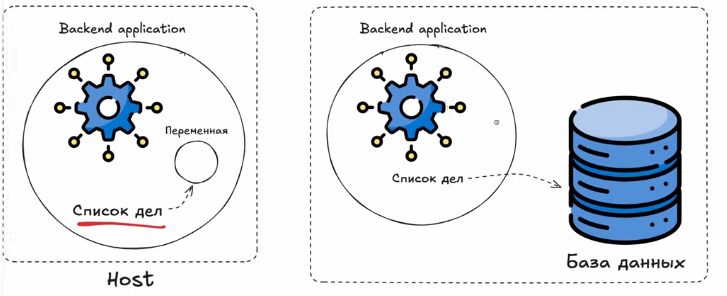
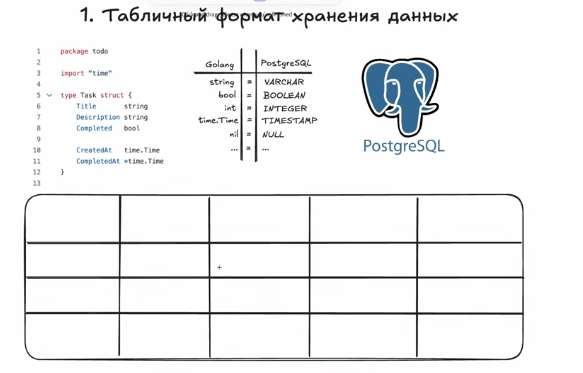
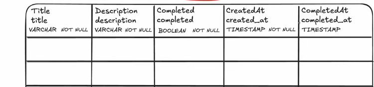
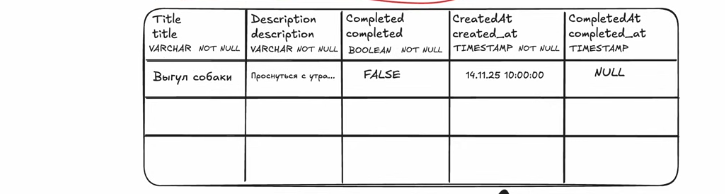
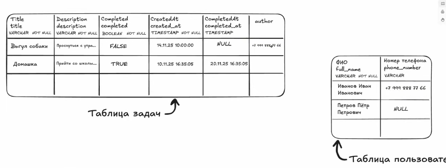
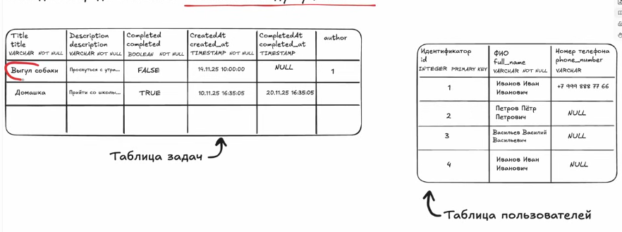
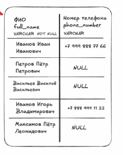

## Проблема надежности хранения баз данных
Основная проблема,которую решают базы данных-это проблема надежности хранения данных 

Например у нас есть наше приложение список дел,которое мы делали,так вот,если приложение завершится,то весь список дел,что был просто удалится. Все потому что у нас список дел хранится в переменной,а переменная существует только в рамках нашего с вами работающего приложения,а если приложение теряется,то теряется и список дел. Даже если мы напишем идеальное приложение,которое не завершается,то тут еще одна проблема-часто надо выкатывать новую версию backend приложения,а чтобы ее выложит надо завершить старое. 

И все эти проблемы решаются с помощью баз данных(далее сокращенно бд). Мы вместо того,чтобы хранить какую-то информацию в переменной ,начинаем ее хранить в  бд. И если приложение сдохнет,то данные не потеряются,так как они хранятся в бд.


И теперь мы можем не переживать,что у нас там что-то завершится по тем или иным причинам,так как, опять же, данные в сохранности. 

Существует множество бд и отличаются они тем,как и где хранят свои данные. 

Первые бд сохраняют свои данные в жд,а вторые в оперативке. Отличие в том,что те бд,что работают в оперативке быстрее тех,что хранят данные в бд и наоборот. Казалось бы,можно было бы теперь юзать бд,что работают на оперативке,но проблема в том,что при перезагрузке пк или перезапуске приложения все содержимое оперативки очищается,короче, проблемы с сохранностью данных в бд. То же самое и самой бд,так как она тоже является приложением. Такие бд в основном используют для кеширования. 

Вторые бд это те,что хранят данные в жд,они конечно медленные,но этой скорости зачастую достаточно для работы и к тому же скорость невелируется надежностью. Но если жд выйдет из строя,то все данные потеряются,если ограничиваться одним физическим жд :)

Если же он не один,то можно просто копировать данные с одного жд в другой,чтобы при поломке диска ничего не потерялось. 


## PostgreSQL теория

Это бд,которая хранит данные на жд и обеспечивает стабильную и надежную работу при больших нагрузках. 

Первым делом поговорим про то,в каком формате PSQL хранит данные, а точнее в табличном формате. Это можно сравнить с excel таблицами


Для примера возьмем наше приложение "список дел", допустим мы теперь хотим хранить все данные в бд, а конкретно в PSQL. Теперь надо понять,как у нас эти данные из go лягут в табличное представление, на картинке видно,какой тип из go сопоставлен типу из psql.  Каждое поле структуры это какой-то столбец в psql. 
Это все как-то так выглядеть будет в бд:


Как мы видим,у нас нейминг столбцов с маленькой буквы,если слова два,то они разделяются нижним подчеркиванием, также если поле не может быть нулевым(что-то должно в себе хранить),то рядом с типом пишем NOT NULL,так как если поля будут нулевыми,данные не будут иметь смысла. Но у completed_at по-другому, так как в структуре у нас она имеет тип  * time.Time, то при создании экземпляра там по-умолчанию будет  nil, поэтому в бд мы к этому столбцу не добавляем NOT NULL. 

Если вставить в таблицу какие-то данные,то это будет выглядеть так:


## Реляционная база данных

PSQL представляет из себя реляционную(от англ. retionship) бд. Это значит,что у psql возможны отношения между сущностями. В качестве примера возьмем нашу старую таблицу, представим,что помимо таблицы задач у нас есть еще таблица пользователей.


Так как у каждой задачи должен быть автор, мы это пропишем в таблице задач,этого автора можно достать из таблицы пользователей,но как? Номер не подходит,так как его по таблице может вообще не быть,имя тоже,так как может попасться полный тезка. Для этого существует идентификатор (id),бывает обычно типа INTEGER и делается приставка PRIMARY KEY,что означает,что этот столбец создан для однозначной и уникальной идентификации. 
Это нам дает то,что теперь в качестве поля столбца автора мы можем теперь передавать id,чтобы не гадать фио и тд


Это и есть отношения между сущностями, когда в одной таблице хранятся какие-то данные из другой. И в таблице task также надо указать уникальный идентификатор, так как по-умолчанию при создании таблицы это делается,если понадобится не сейчас,то потом. 
Кстати,уникальный идентификатор таблицы зовется первичный ключ,а ключ,с помощью которого мы ссылаемся на эту самую таблицу,зовется внешним. 

## SQL
 Для работы с бд используется язык запросов SQL,через него можно что-то добавлять,брать,удалять и искать из бд.
  Сейчас будет пару примерчиков таких примитивных. 

Для того,чтобы в добавить что-то в таблицу users для его полей(full_name,phone_number)  в бд,надо написать :
```sql
INSERT INTO users(full_name,phone_number) -- так как id это primary key,то нам не надо тут его указывать
VALUES("Пахан Шафи","89882281488"); --тут указываюся значения
```
Мы говорим через `INSERT INTO`,что хотим создать новую запись в бд, потом указываем конкретную таблицу,куда добавлять будем, далее перечисляем в скобочках в какие именно столбцы вставлять будем, а потом через `VALUES` говорим конкретно что хотим добавить в поля таблицы. Таким макаром создается новая запись в таблице нашей базы. 

Если бы пользователь не указал номер телефона,то было бы так:
```sql
INSERT INTO users(full_name) 
VALUES("Дима Узбек");
```

Теперь если нам надо получить всех юзеров, надо написать следующее:
```sql
SELECT full_name,phone_number -- какие столбцы нужны в выборке
FROM users -- откуда берем
```
Этот запрос нам вернет следующее:


Если брать пример фильтрационного условия(например, юзеры,у которых есть номер телефона):
```sql
SELECT full_name,phone_number -- какие столбцы нужны в выборке
FROM users -- откуда берем
WHERE phone_number IS NOT NULL -- вот и условие
```

Теперь пример удаления, например нам надо удалить пользователя, то будет выглядеть так:
```sql
DELETE FROM users -- откуда удаляем
WHERE id=2 --кого удаляем
```

То есть,если у пользователя id=2, то он удалится. 