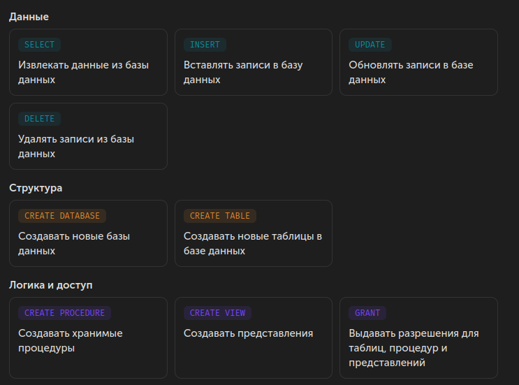
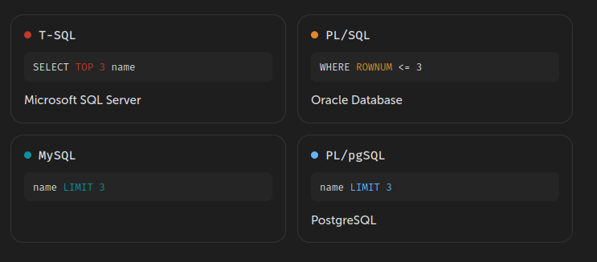

SQL — язык структурированных запросов (SQL, Structured Query Language), который используется в качестве эффективного способа сохранения данных, поиска их частей, обновления, извлечения и удаления из базы данных.

С реляционными СУБД общаются именно на SQL. С его помощью выполняются все основные операции с базами данных:

## Диалекты SQL (расширения SQL)

Язык SQL – универсальный язык для всех реляционных систем управления базами данных, но многие СУБД вносят свои изменения в язык, применяемый в них, тем самым отступая от стандарта. Такие языки называют диалектами или расширениями языка.

Вот некоторые из них. Для примера посмотрим, как в каждой из этих СУБД выбираются первые 3 строки.
